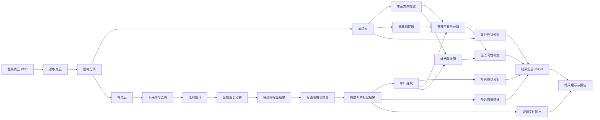

## 数据流向图

```mermaid
flowchart LR
    A[整株点云 PCD] --> B[读取点云]
    B --> C[茎叶分离]
    C --> D[茎点云]
    C --> E[叶点云]

    E --> F[下采样与去噪]
    F --> G[法向估计]
    G --> H[区域生长分割]
    H --> I[稀疏带标签结果]
    I --> J[标签映射与修复]
    J --> K[完整叶片标记结果]

    D --> L[主茎方向提取]
    D --> M[茎基部提取]
    D --> N[茎秆性状分析]

    K --> O[单叶提取]
    O --> P[叶片性状分析]
    K --> Q[叶片数量统计]

    L --> R[整株生长角计算]
    M --> R
    O --> R

    L --> S[叶柄角计算]
    O --> S

    R --> T[生长习性判定]
    S --> T

    N --> U[结果汇总 JSON]
    P --> U
    Q --> U
    T --> U

    K --> V[证据文件输出]
    U --> W[结果展示与报告]
    V --> W
```
