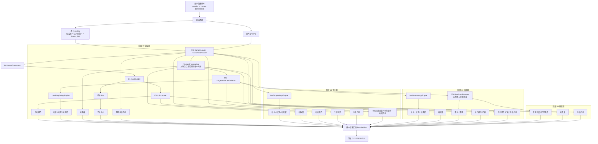

# 菜薹/芥蓝表型系统数据流图 v2（GitHub Mermaid 修正版）

> 当前口径：
> - 输入点云已经去噪、已尺度归一、已按 `Scalar_field` 标注茎/叶/花
> - 阶段 10 / 20 / 30 的叶长 / 叶宽 / 叶面积共用同一流程
> - 参考叶当前统一按 `最大面积叶片` 近似 `最大完整叶`
> - 阶段 10 并行输出子叶大小 / 子叶颜色
> - 抽薹期日期型性状不在本图中
> - 开花期不做颜色

